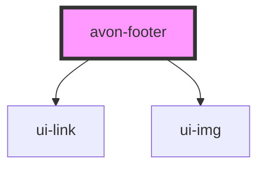

# avon-footer

<!-- Auto Generated Below -->

## Properties

| Property  | Attribute | Description | Type      | Default     |
| --------- | --------- | ----------- | --------- | ----------- |
| `content` | `content` |             | `any`     | `undefined` |
| `isDark`  | `is-dark` |             | `boolean` | `false`     |

## Dependencies

### Depends on

- [ui-link](../ui-link)
- [ui-img](../ui-img)

### Graph

---

_Built with [StencilJS](https://stenciljs.com/)_
