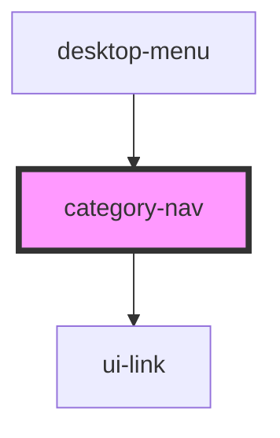

# category-nav

<!-- Auto Generated Below -->

## Properties

| Property     | Attribute | Description | Type    | Default |
| ------------ | --------- | ----------- | ------- | ------- |
| `categories` | --        |             | `any[]` | `[]`    |

## Dependencies

### Used by

- [desktop-menu](../desktop-menu)

### Depends on

- ui-link

### Graph

---

_Built with [StencilJS](https://stenciljs.com/)_
