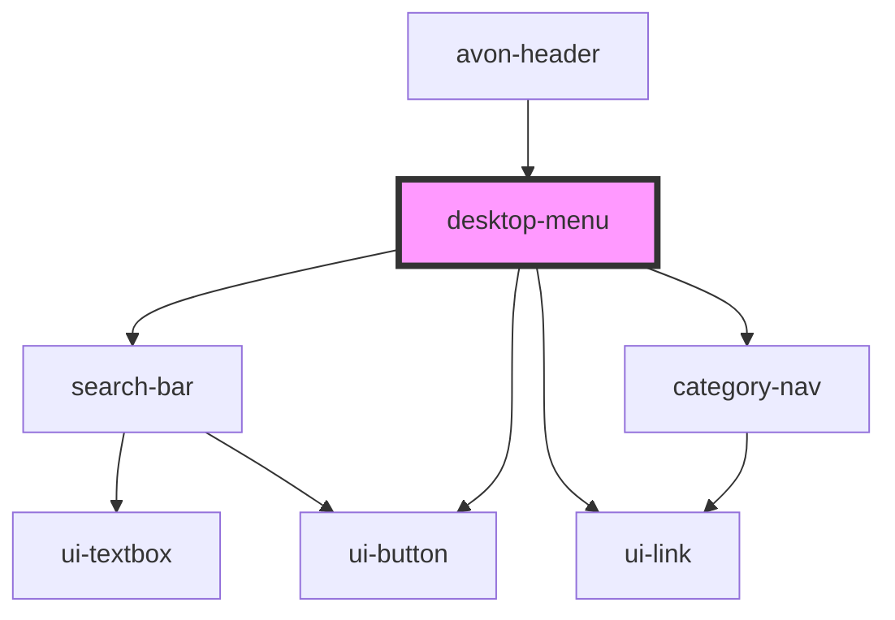

# desktop-menu

<!-- Auto Generated Below -->

## Properties

| Property        | Attribute        | Description | Type     | Default |
| --------------- | ---------------- | ----------- | -------- | ------- |
| `cartCount`     | `cart-count`     |             | `number` | `0`     |
| `data`          | `data`           |             | `any`    | `null`  |
| `settings`      | `settings`       |             | `any`    | `null`  |
| `wishlistCount` | `wishlist-count` |             | `number` | `0`     |

## Events

| Event      | Description | Type                |
| ---------- | ----------- | ------------------- |
| `showCart` |             | `CustomEvent<void>` |

## Dependencies

### Used by

- [avon-header](..)

### Depends on

- [search-bar](../search-bar)
- ui-button
- ui-link
- [category-nav](../category-nav)

### Graph

---

_Built with [StencilJS](https://stenciljs.com/)_
