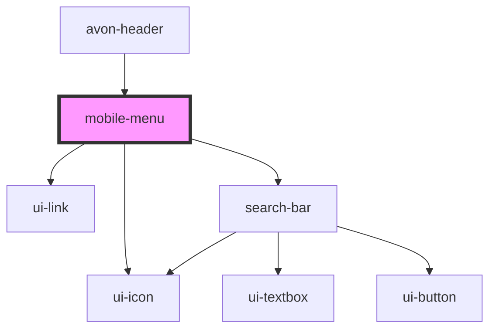

# mobile-menu

<!-- Auto Generated Below -->

## Properties

| Property       | Attribute    | Description | Type    | Default     |
| -------------- | ------------ | ----------- | ------- | ----------- |
| `cartCount`    | `cart-count` |             | `any`   | `undefined` |
| `categoryList` | --           |             | `any[]` | `[]`        |
| `settings`     | `settings`   |             | `any`   | `null`      |

## Dependencies

### Used by

- [avon-header](..)

### Depends on

- ui-icon
- [ui-link](../../ui-link)
- [search-bar](../search-bar)

### Graph

---

_Built with [StencilJS](https://stenciljs.com/)_
