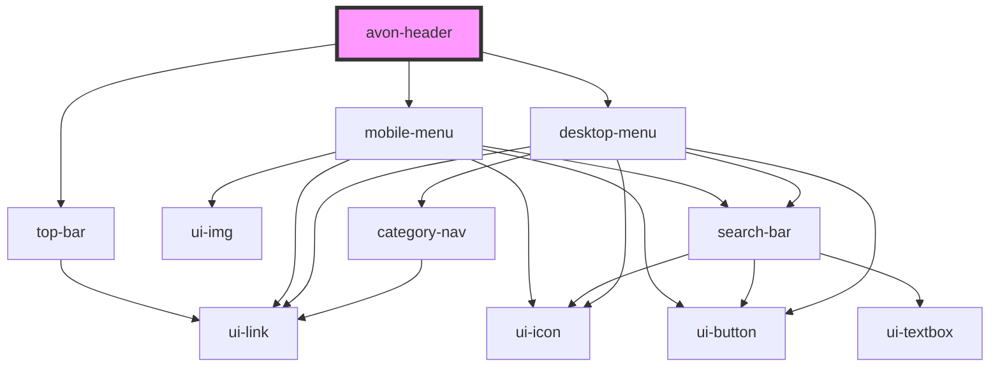

# avon-header

<!-- Auto Generated Below -->

## Properties

| Property  | Attribute | Description | Type  | Default     |
| --------- | --------- | ----------- | ----- | ----------- |
| `content` | `content` |             | `any` | `undefined` |

## Dependencies

### Depends on

- [top-bar](top-bar)
- [mobile-menu](mobile-menu)
- [desktop-menu](desktop-menu)

### Graph

---

_Built with [StencilJS](https://stenciljs.com/)_
