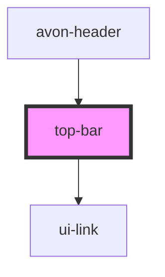

# avon-topbar

<!-- Auto Generated Below -->

## Properties

| Property   | Attribute  | Description | Type  | Default |
| ---------- | ---------- | ----------- | ----- | ------- |
| `settings` | `settings` |             | `any` | `null`  |

## Dependencies

### Used by

 - [avon-header](..)

### Depends on

- ui-link

### Graph

----------------------------------------------

*Built with [StencilJS](https://stenciljs.com/)*
