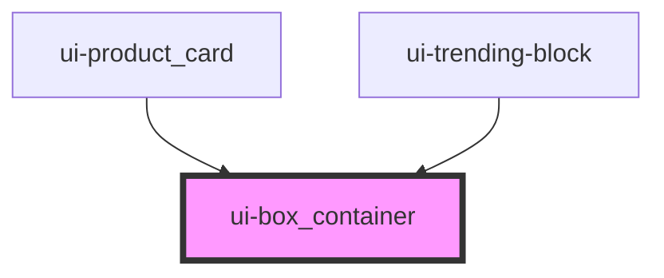

# swc-box_container

<!-- Auto Generated Below -->

## Properties

| Property          | Attribute         | Description      | Type     | Default   |
| ----------------- | ----------------- | ---------------- | -------- | --------- |
| `backgroundcolor` | `backgroundcolor` | background-color | `string` | `'white'` |
| `backgroundimage` | `backgroundimage` | background-color | `string` | `''`      |
| `display`         | `display`         | display          | `string` | `'block'` |
| `height`          | `height`          | height           | `string` | `'300px'` |
| `width`           | `width`           | Width            | `string` | `'100%'`  |

## Dependencies

### Used by

- [ui-product_card](../ui-product_card)
- [ui-trending-block](../ui-trending-block)

### Graph

---

_Built with [StencilJS](https://stenciljs.com/)_
