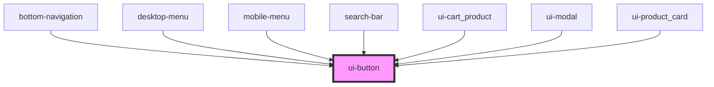

# avon-button

<!-- Auto Generated Below -->

## Properties

| Property   | Attribute  | Description  | Type                                             | Default        |
| ---------- | ---------- | ------------ | ------------------------------------------------ | -------------- |
| `color`    | `color`    |              | `"clear" \| "light" \| "primary" \| "secondary"` | `'primary'`    |
| `disabled` | `disabled` |              | `boolean`                                        | `false`        |
| `label`    | `label`    | Button Label | `string`                                         | `''`           |
| `shape`    | `shape`    |              | `"full" \| "round" \| "smooth" \| "text"`        | `'full'`       |
| `size`     | `size`     |              | `"large" \| "medium" \| "small"`                 | `'large'`      |
| `width`    | `width`    |              | `"fullwidth" \| "mediumwidth" \| "smallwidth"`   | `'smallwidth'` |

## Dependencies

### Used by

- [bottom-navigation](../bottom-navigation)
- [desktop-menu](../avon-header/desktop-menu)
- [mobile-menu](../avon-header/mobile-menu)
- [search-bar](../avon-header/search-bar)
- [ui-cart_product](../ui-cart_product)
- [ui-modal](../ui-modal)
- [ui-product_card](../ui-product_card)

### Graph

---

_Built with [StencilJS](https://stenciljs.com/)_
