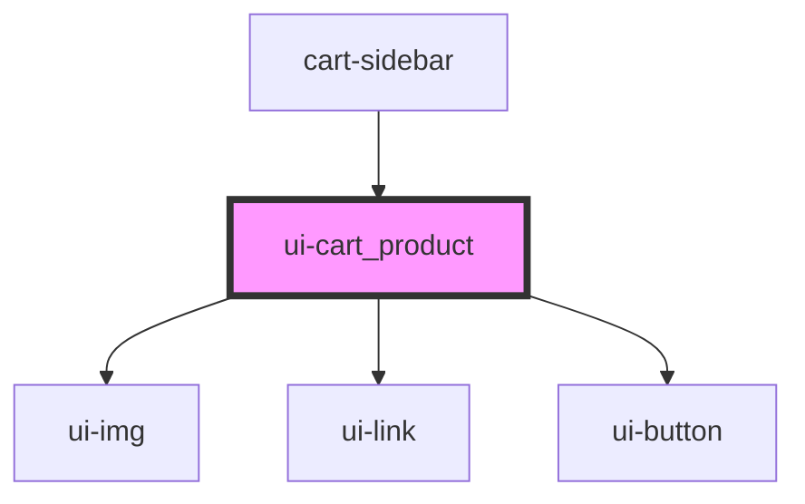

# swc-box_container

<!-- Auto Generated Below -->

## Properties

| Property          | Attribute         | Description                                     | Type       | Default                   |
| ----------------- | ----------------- | ----------------------------------------------- | ---------- | ------------------------- |
| `boxbgcolor`      | `boxbgcolor`      | box bgcolor                                     | `string`   | `'white'`                 |
| `boxheight`       | `boxheight`       | box height                                      | `string`   | `'300'`                   |
| `boxwidth`        | `boxwidth`        | box width                                       | `string`   | `'300'`                   |
| `heading`         | `heading`         | Product Heading                                 | `string`   | `undefined`               |
| `image`           | `image`           | Image src                                       | `string`   | `undefined`               |
| `imgalt`          | `imgalt`          | image alt                                       | `string`   | `'src_eg'`                |
| `imgheight`       | `imgheight`       | image height                                    | `string`   | `'200'`                   |
| `imgwidth`        | `imgwidth`        | image width                                     | `string`   | `'180'`                   |
| `link`            | `link`            | link                                            | `string`   | `undefined`               |
| `price`           | `price`           | price                                           | `string`   | `undefined`               |
| `removeCallback`  | --                | removeCallback works only in Stencil components | `Function` | `undefined`               |
| `titlecolor`      | `titlecolor`      | titlecolor                                      | `string`   | `'#43464E'`               |
| `titlefontfamily` | `titlefontfamily` | title fontfamily                                | `string`   | `'Montserrat,sans-serif'` |
| `titlefontsize`   | `titlefontsize`   | title fontsize                                  | `string`   | `'16px'`                  |

## Dependencies

### Used by

- [cart-sidebar](../cart-sidebar)

### Depends on

- [ui-img](../ui-img)
- [ui-link](../ui-link)
- [ui-button](../ui-button)

### Graph

---

_Built with [StencilJS](https://stenciljs.com/)_
