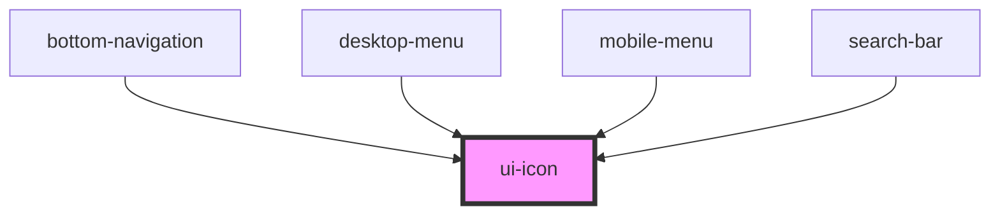

# an-example

<!-- Auto Generated Below -->

## Properties

| Property | Attribute | Description | Type     | Default     |
| -------- | --------- | ----------- | -------- | ----------- |
| `color`  | `color`   |             | `any`    | `undefined` |
| `icon`   | `icon`    |             | `string` | `undefined` |
| `size`   | `size`    |             | `any`    | `undefined` |

## Dependencies

### Used by

- [bottom-navigation](../bottom-navigation)
- [desktop-menu](../avon-header/desktop-menu)
- [mobile-menu](../avon-header/mobile-menu)
- [search-bar](../avon-header/search-bar)

### Graph

---

_Built with [StencilJS](https://stenciljs.com/)_
