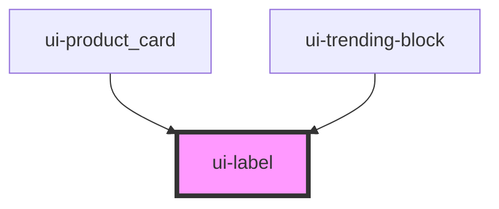

# swc-label

<!-- Auto Generated Below -->

## Properties

| Property     | Attribute    | Description | Type     | Default         |
| ------------ | ------------ | ----------- | -------- | --------------- |
| `color`      | `color`      | color       | `string` | `'black'`       |
| `fontfamily` | `fontfamily` | font-family | `string` | `'Arial,serif'` |
| `fontsize`   | `fontsize`   | font-size   | `string` | `'12px'`        |
| `fontweight` | `fontweight` | font-weight | `string` | `'100'`         |
| `label`      | `label`      | Label       | `string` | `undefined`     |

## Dependencies

### Used by

- [ui-product_card](../ui-product_card)
- [ui-trending-block](../ui-trending-block)

### Graph

---

_Built with [StencilJS](https://stenciljs.com/)_
