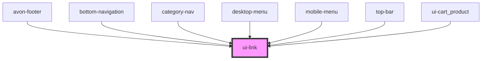

# avon-link

<!-- Auto Generated Below -->

## Properties

| Property         | Attribute        | Description     | Type     | Default                    |
| ---------------- | ---------------- | --------------- | -------- | -------------------------- |
| `class`          | `class`          | class           | `string` | `undefined`                |
| `color`          | `color`          | color           | `string` | `'#7f28c4'`                |
| `fontfamily`     | `fontfamily`     | font-family     | `string` | `'Montserrat,Arial,serif'` |
| `fontsize`       | `fontsize`       | font-size       | `string` | `'12px'`                   |
| `fontweight`     | `fontweight`     | font-weight     | `string` | `'100'`                    |
| `link`           | `link`           | link            | `string` | `undefined`                |
| `textdecoration` | `textdecoration` | text-decoration | `string` | `'none'`                   |

## Dependencies

### Used by

- [avon-footer](../avon-footer)
- [bottom-navigation](../bottom-navigation)
- [category-nav](../avon-header/category-nav)
- [desktop-menu](../avon-header/desktop-menu)
- [mobile-menu](../avon-header/mobile-menu)
- [top-bar](../avon-header/top-bar)
- [ui-cart_product](../ui-cart_product)

### Graph

---

_Built with [StencilJS](https://stenciljs.com/)_
