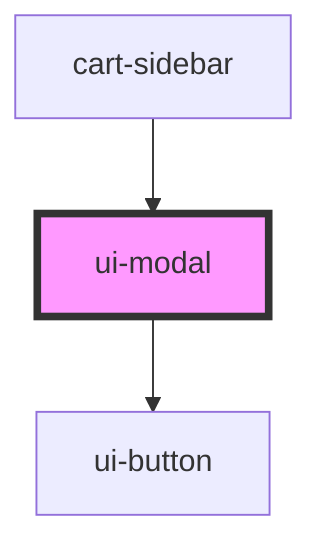

# swc-modal

<!-- Auto Generated Below -->

## Properties

| Property          | Attribute         | Description                                    | Type                                                 | Default                 |
| ----------------- | ----------------- | ---------------------------------------------- | ---------------------------------------------------- | ----------------------- |
| `btncolor`        | `btncolor`        | Button color                                   | `"clear" \| "light" \| "primary" \| "secondary"`     | `'secondary'`           |
| `buttonlabel`     | `buttonlabel`     | button-label                                   | `string`                                             | `'Go back to shopping'` |
| `closeCallback`   | --                | closeCallback works only in Stencil components | `Function`                                           | `undefined`             |
| `height`          | `height`          | height                                         | `string`                                             | `'100%'`                |
| `modalId`         | `modal-id`        | Id                                             | `string`                                             | `undefined`             |
| `modaltitle`      | `modaltitle`      | Heading                                        | `string`                                             | `undefined`             |
| `open`            | `open`            | open                                           | `boolean`                                            | `false`                 |
| `position`        | `position`        | Position of modal                              | `"bottom" \| "center" \| "left" \| "right" \| "top"` | `'right'`               |
| `titlecolor`      | `titlecolor`      | Title color                                    | `string`                                             | `'black'`               |
| `titlefontfamily` | `titlefontfamily` | Title font-family                              | `string`                                             | `'Montserrat,Arial'`    |
| `titlefontsize`   | `titlefontsize`   | Title font-size                                | `string`                                             | `'18.72px'`             |
| `titlefontweight` | `titlefontweight` | Title font-weight                              | `string`                                             | `'100'`                 |
| `width`           | `width`           | width                                          | `string`                                             | `'300px'`               |

## Events

| Event   | Description | Type                                              |
| ------- | ----------- | ------------------------------------------------- |
| `modal` |             | `CustomEvent<{ modalId: string; payload?: {}; }>` |

## Dependencies

### Used by

- [cart-sidebar](../cart-sidebar)

### Depends on

- [ui-button](../ui-button)

### Graph

---

_Built with [StencilJS](https://stenciljs.com/)_
