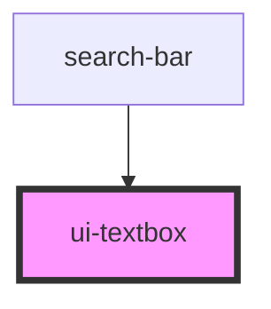

# swc-textbox

<!-- Auto Generated Below -->

## Properties

| Property      | Attribute     | Description | Type                                           | Default        |
| ------------- | ------------- | ----------- | ---------------------------------------------- | -------------- |
| `disabled`    | `disabled`    |             | `boolean`                                      | `false`        |
| `placeholder` | `placeholder` |             | `string`                                       | `undefined`    |
| `shape`       | `shape`       |             | `"full" \| "round" \| "smooth"`                | `'full'`       |
| `usecase`     | `usecase`     |             | `"loginform" \| "search"`                      | `'search'`     |
| `width`       | `width`       |             | `"fullwidth" \| "mediumwidth" \| "smallwidth"` | `'smallwidth'` |

## Dependencies

### Used by

- [search-bar](../avon-header/search-bar)

### Graph

---

_Built with [StencilJS](https://stenciljs.com/)_
