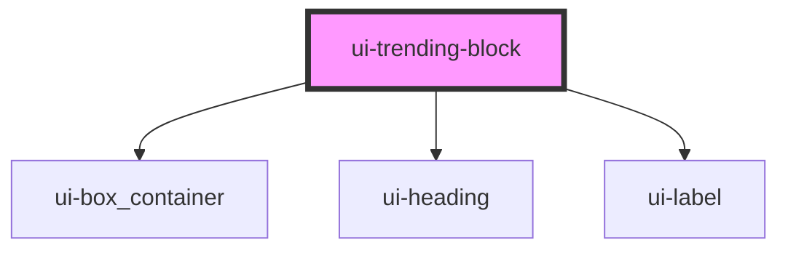

# ui-trending-block

<!-- Auto Generated Below -->

## Properties

| Property      | Attribute     | Description | Type     | Default                                                                                                                  |
| ------------- | ------------- | ----------- | -------- | ------------------------------------------------------------------------------------------------------------------------ |
| `cardbgimage` | `cardbgimage` | The label   | `string` | `'https://www.shopwithmyrep.co.uk/mediamarket-uk/10104/microsoftteams-image-5_unq_94575c318ac6482f96b42678acc7852e.png'` |
| `cardheight`  | `cardheight`  |             | `string` | `undefined`                                                                                                              |
| `cardwidth`   | `cardwidth`   |             | `string` | `undefined`                                                                                                              |
| `description` | `description` |             | `string` | `'Trending stories description'`                                                                                         |
| `heading`     | `heading`     |             | `string` | `'Product Title'`                                                                                                        |
| `headingptop` | `headingptop` |             | `string` | `'200px'`                                                                                                                |

## Dependencies

### Depends on

- [ui-box_container](../ui-box_container)
- [ui-heading](../ui-heading)
- [ui-label](../ui-label)

### Graph

---

_Built with [StencilJS](https://stenciljs.com/)_
